# A2A Protocol Integration - Architecture Diagrams

## Current Architecture (v2.5.0)

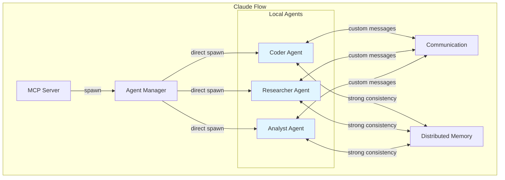

**Limitations:**
- ❌ No cross-swarm communication
- ❌ No external agent support
- ❌ Strong consistency bottleneck
- ❌ Custom message format only

---

## Target Architecture (v3.0.0)

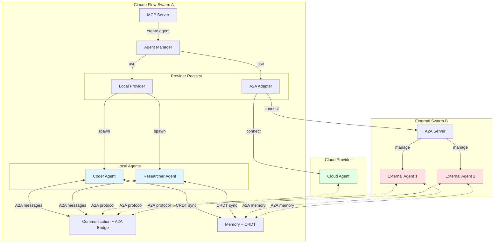

**Capabilities:**
- ✅ Multi-swarm communication via A2A
- ✅ External agent integration
- ✅ CRDT eventual consistency
- ✅ Standardized message format
- ✅ Cloud provider support

---

## Component Interaction Flow

### 1. Agent Creation Flow (With A2A)

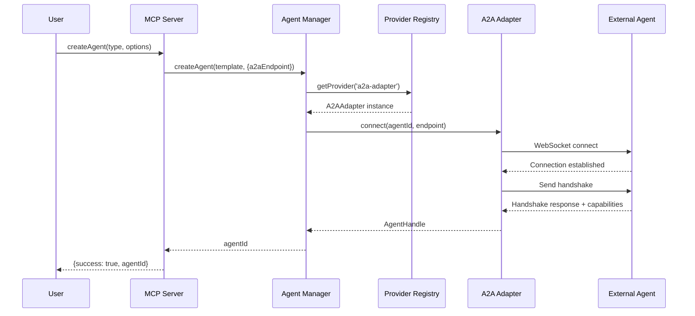

### 2. Cross-Swarm Communication Flow

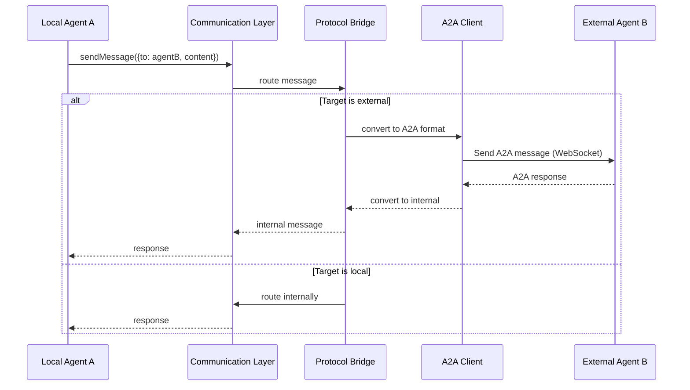

### 3. Memory Sync with CRDT

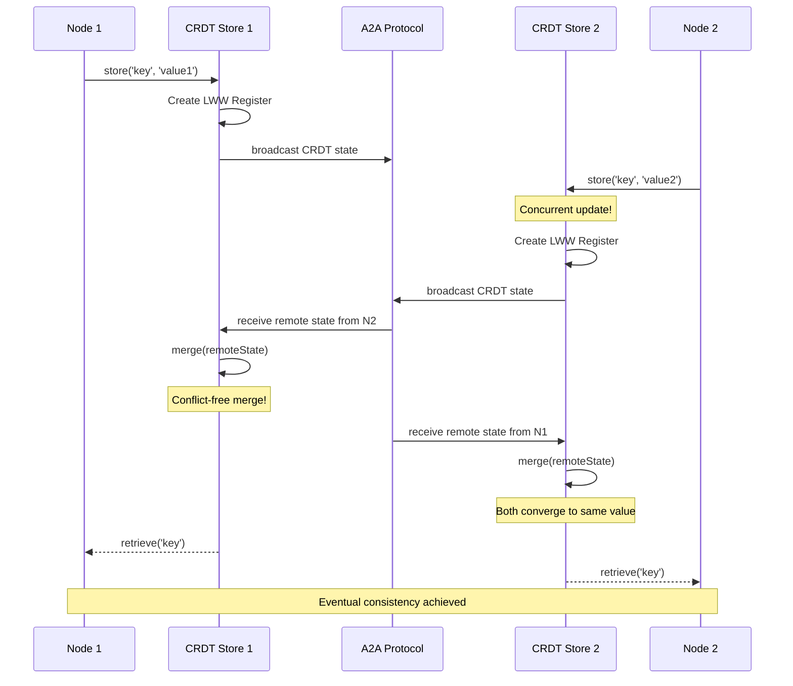

---

## Provider Architecture

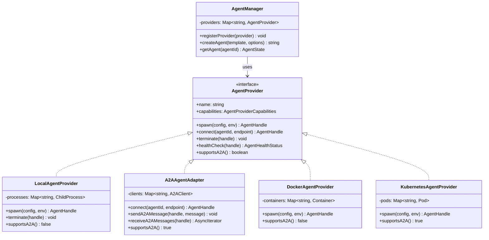

**Benefits:**
- ✅ Pluggable architecture
- ✅ Easy to add new providers
- ✅ Clean separation of concerns
- ✅ Testable in isolation

---

## CRDT Data Flow

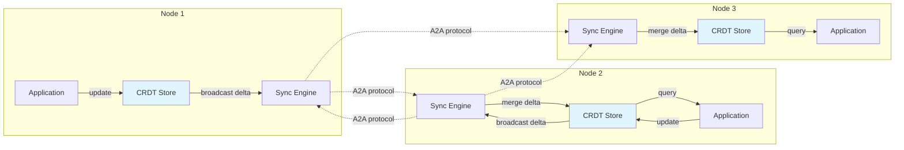

**CRDT Types Supported:**
- **LWW Register:** Last-Write-Wins for simple values
- **OR-Set:** Observed-Remove Set for collections
- **PN-Counter:** Positive-Negative Counter for metrics
- **RGA:** Replicated Growable Array for ordered lists

---

## Message Translation Layer

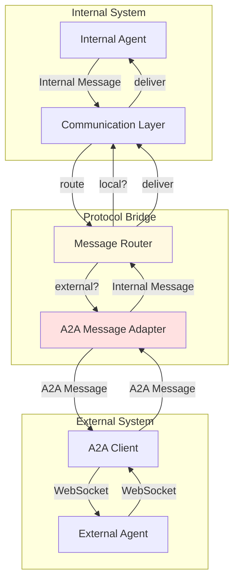

**Message Format Mapping:**

| Internal | A2A | Notes |
|----------|-----|-------|
| `direct` | `message.direct` | 1:1 mapping |
| `broadcast` | `message.broadcast` | 1:1 mapping |
| `consensus` | `consensus.vote` | Semantic mapping |
| `query` | `query.request` | Request/response pattern |
| `response` | `query.response` | Request/response pattern |

---

## MCP Tool Integration

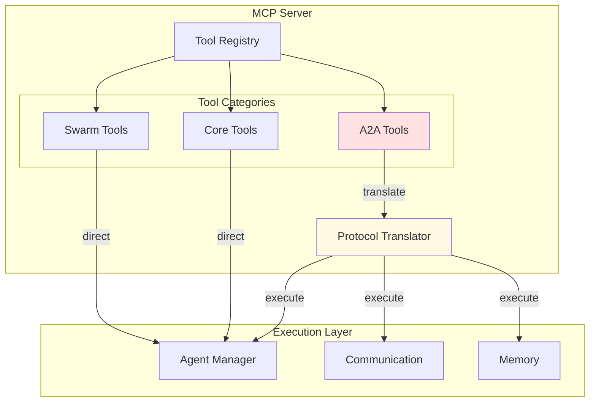

**New A2A Tools:**
- `a2a/agent/connect` - Connect to external A2A agent
- `a2a/agent/discover` - Discover available agents
- `a2a/message/send` - Send A2A message
- `a2a/memory/sync` - Synchronize memory partition

---

## Deployment Topology Examples

### Single Swarm (Current)

```
┌─────────────────────────────┐
│      Claude Flow Host       │
│                             │
│  ┌─────────────────────┐   │
│  │   Agent Manager     │   │
│  └─────────────────────┘   │
│                             │
│  ┌───┐ ┌───┐ ┌───┐ ┌───┐   │
│  │A1 │ │A2 │ │A3 │ │A4 │   │
│  └───┘ └───┘ └───┘ └───┘   │
│                             │
│  ┌─────────────────────┐   │
│  │  Memory (Strong)    │   │
│  └─────────────────────┘   │
└─────────────────────────────┘
```

### Multi-Swarm with A2A (Target)

```
┌─────────────────────┐      ┌─────────────────────┐      ┌─────────────────────┐
│   Swarm A (Local)   │      │   Swarm B (Cloud)   │      │  Swarm C (Partner)  │
│                     │      │                     │      │                     │
│  ┌────────────┐    │      │  ┌────────────┐    │      │  ┌────────────┐    │
│  │Local Agents│    │      │  │Cloud Agents│    │      │  │Ext. Agents │    │
│  │ A1  A2  A3 │    │      │  │ B1  B2     │    │      │  │ C1  C2  C3 │    │
│  └────────────┘    │      │  └────────────┘    │      │  └────────────┘    │
│                     │      │                     │      │                     │
│  ┌────────────┐    │      │  ┌────────────┐    │      │  ┌────────────┐    │
│  │ CRDT Store │    │      │  │ CRDT Store │    │      │  │ CRDT Store │    │
│  └────────────┘    │      │  └────────────┘    │      │  └────────────┘    │
│         │           │      │         │           │      │         │           │
└─────────┼───────────┘      └─────────┼───────────┘      └─────────┼───────────┘
          │                            │                            │
          │         A2A Protocol       │         A2A Protocol       │
          └────────────────────────────┴────────────────────────────┘
                           (WebSocket)
```

**Benefits:**
- ✅ Geographic distribution
- ✅ Cloud bursting
- ✅ Partner collaboration
- ✅ Fault isolation

---

## Performance Comparison

### Memory Sync Latency vs. Node Count

```
Strong Consistency (Current)
────────────────────────────
Nodes    Latency
2        100ms   ██
5        250ms   █████
10       500ms   ██████████
20      1000ms   ████████████████████

Eventual Consistency (A2A + CRDT)
─────────────────────────────────
Nodes    Latency
2         10ms   █
5         10ms   █
10        10ms   █
20        10ms   █

Improvement: 10x-100x faster at scale
```

### Message Throughput

```
Internal Messages (Current)
───────────────────────────
Single Connection: 500 msg/sec  ████████████

A2A Messages (With Protocol Translation)
────────────────────────────────────────
Single Connection: 100 msg/sec  ██
Multiple Connections: 1000 msg/sec ████████████████████

Trade-off: Lower per-connection throughput, but unlimited connections
```

---

## Migration Path Visualization

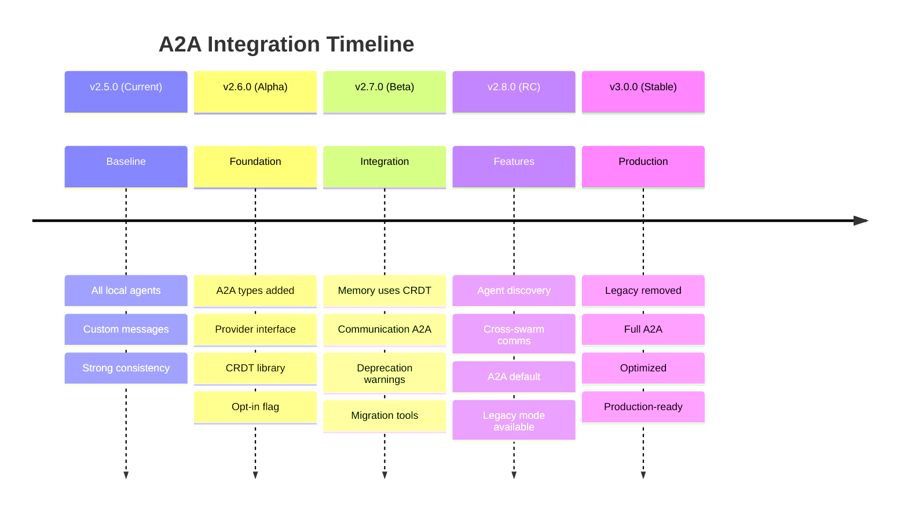

---

## Testing Architecture

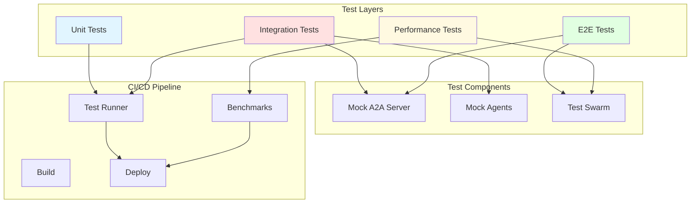

**Test Coverage Targets:**
- Unit Tests: 95%+
- Integration Tests: 85%+
- E2E Tests: Key workflows
- Performance: Regression < 10%

---

**Document Version:** 1.0
**Date:** 2025-10-01
**Related:** [A2A-REFACTORING-GUIDE.md](./A2A-REFACTORING-GUIDE.md)
