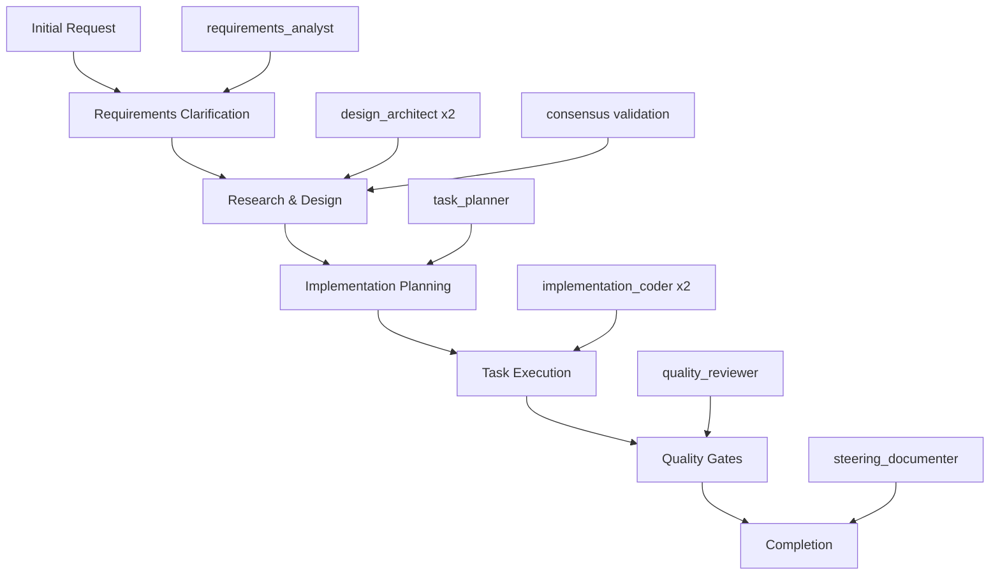

# Maestro Comprehensive Guide

> **Complete Reference for Specs-Driven Development with Native Hive Mind Intelligence**

This comprehensive guide combines complete workflow documentation with detailed command reference for Maestro's specifications-driven development framework. It covers everything from basic usage to advanced swarm coordination patterns.

## Table of Contents

- [Quick Start](#quick-start)
- [Complete Workflow Guide](#complete-workflow-guide)
- [Command Reference](#command-reference)
- [Advanced Features](#advanced-features)
- [Troubleshooting](#troubleshooting)
- [Best Practices](#best-practices)

---

# Quick Start

## Prerequisites
```bash
# Ensure you have a recent version
npm install -g claude-flow@alpha  # Or use npx

# Verify installation
npx claude-flow maestro help
```

## Basic Workflow
```bash
# 1. Create specification
npx claude-flow maestro create-spec my-feature \
  --request "Create user authentication system"

# 2. Generate design
npx claude-flow maestro generate-design my-feature

# 3. Create tasks
npx claude-flow maestro generate-tasks my-feature

# 4. Implement tasks
npx claude-flow maestro implement-task my-feature 1
npx claude-flow maestro implement-task my-feature 2

# 5. Review quality
npx claude-flow maestro review-tasks my-feature

# 6. Approve and complete
npx claude-flow maestro approve-phase my-feature
```

---

# Complete Workflow Guide

## Overview

This comprehensive guide walks you through the complete Maestro specs-driven development workflow using native hive mind swarm intelligence. The workflow consists of 5 main phases, each powered by specialized agents working in coordination.

## 🧠 Native Hive Mind Architecture

The Maestro workflow leverages a **specs-driven topology** with 6 specialized agent types:

```
Maestro Specs-Driven Swarm Topology
├── requirements_analyst (1)    # Requirements & user stories
├── design_architect (2)        # Parallel design with consensus  
├── task_planner (1)           # Implementation planning
├── implementation_coder (2)    # Parallel implementation
├── quality_reviewer (1)       # Quality gates & validation
└── steering_documenter (1)    # Governance & documentation
```

## 🚀 Complete Workflow Overview



---

## Phase 1: Requirements Clarification

### 🎯 **Objective**
Transform initial feature requests into structured requirements with user stories and acceptance criteria.

### 🤖 **Agent**: `requirements_analyst`
- **Strategy**: Sequential execution for consistency
- **Capabilities**: `requirements_analysis`, `user_story_creation`, `acceptance_criteria`

### 📋 **Step-by-Step Process**

#### Step 1.1: Initialize Maestro Swarm
```bash
# The swarm initialization happens automatically with the first command
npx claude-flow maestro create-spec user-authentication \
  --request "Implement secure user authentication with JWT tokens"
```

**What happens internally:**
1. Native hive mind swarm initializes with specs-driven topology
2. 8 specialized agents spawn automatically
3. Swarm memory initializes with default steering documents
4. Queen coordination mode activates for strategic task distribution

#### Step 1.2: Requirements Analysis Process
The `requirements_analyst` agent performs:

1. **Requirements Gathering**
   - Analyzes initial request for scope and complexity
   - Identifies stakeholders and user personas
   - Extracts functional and non-functional requirements

2. **User Story Creation**
   - Converts requirements into user story format
   - Follows "As a [user], I want [goal] so that [benefit]" structure
   - Prioritizes stories by business value

3. **Acceptance Criteria Definition**
   - Creates testable acceptance criteria for each user story
   - Uses Given-When-Then format where appropriate
   - Defines definition of done

#### Step 1.3: Generated Output Structure
```markdown
# Feature Requirements: user-authentication

## Overview
Comprehensive user authentication system with JWT token-based security.

## User Stories

### Epic: User Authentication
**As a** user
**I want** to securely authenticate to the system
**So that** I can access protected resources safely

#### Story 1: User Login
**As a** registered user
**I want** to login with email and password
**So that** I can access my account

**Acceptance Criteria:**
- [ ] User can login with valid email/password combination
- [ ] System rejects invalid credentials with clear error message
- [ ] JWT token is generated upon successful authentication
- [ ] Token expires after configurable time period
```

#### Step 1.4: Validation & Review
```bash
# Check the generated requirements
cat docs/maestro/specs/user-authentication/requirements.md

# Review workflow status
npx claude-flow maestro status user-authentication --detailed
```

---

## Phase 2: Research & Design

### 🎯 **Objective**
Create comprehensive technical design through parallel architecture development with consensus validation.

### 🤖 **Agents**: `design_architect` (2 agents)
- **Strategy**: Parallel execution with consensus validation
- **Capabilities**: `system_design`, `architecture`, `specs_driven_design`

### 📋 **Step-by-Step Process**

#### Step 2.1: Initiate Design Generation
```bash
npx claude-flow maestro generate-design user-authentication
```

#### Step 2.2: Parallel Design Process
**What happens internally:**

1. **Agent Coordination**
   - 2 design_architect agents work simultaneously
   - Each agent develops independent design proposals
   - Queen coordinates resource allocation and task distribution

2. **Parallel Design Development**
   
   **Agent 1 Focus Areas:**
   - Database schema design
   - Authentication flow architecture
   - Security considerations
   
   **Agent 2 Focus Areas:**
   - API endpoint design
   - Token management strategy
   - Error handling patterns

3. **Consensus Validation**
   - Both agents must achieve ≥66% agreement on design decisions
   - Byzantine fault-tolerant consensus ensures reliability
   - Conflicting designs trigger additional negotiation rounds

#### Step 2.3: Design Integration & Output
The consensus process produces integrated design covering:

```markdown
# Technical Design: user-authentication

## Architecture Overview
Microservice-based authentication system with JWT token management.

## System Components

### 1. Authentication Service
- **Purpose**: Handle login/logout operations
- **Technology**: Node.js with Express
- **Database**: PostgreSQL with bcrypt hashing

### 2. Token Management
- **JWT Implementation**: jsonwebtoken library
- **Token Storage**: Redis for blacklisting
- **Refresh Strategy**: Rolling refresh tokens

## Consensus Decision Summary
- ✅ JWT tokens with 1-hour expiration (Agreement: 85%)
- ✅ Bcrypt with 12 salt rounds (Agreement: 100%)
- ✅ Redis for token blacklisting (Agreement: 75%)
- ✅ Rate limiting at 5 attempts/minute (Agreement: 90%)
```

---

## Phase 3: Implementation Planning

### 🎯 **Objective**
Break down the technical design into actionable implementation tasks with clear dependencies.

### 🤖 **Agent**: `task_planner`
- **Strategy**: Sequential execution for coherent task breakdown
- **Capabilities**: `task_management`, `workflow_orchestration`

### 📋 **Step-by-Step Process**

#### Step 3.1: Generate Implementation Tasks
```bash
npx claude-flow maestro generate-tasks user-authentication
```

#### Step 3.2: Task Planning Process
The `task_planner` agent performs:

1. **Design Analysis**
   - Parses technical design document
   - Identifies all system components
   - Maps dependencies between components

2. **Task Decomposition**
   - Breaks design into implementable tasks
   - Estimates task complexity and duration
   - Defines task dependencies and order

3. **Resource Planning**
   - Assigns tasks to appropriate skill areas
   - Balances workload across implementation phases
   - Identifies critical path items

#### Step 3.3: Generated Task Structure
```markdown
# Implementation Tasks: user-authentication

## Phase 1: Foundation Setup
**Estimated Duration**: 4-6 hours

- [ ] **Task 1**: Initialize project structure
  - Create Node.js project with TypeScript
  - Setup Express server framework
  - Configure development environment
  - **Dependencies**: None
  - **Assigned to**: implementation_coder

- [ ] **Task 2**: Database setup and configuration
  - Setup PostgreSQL database
  - Create users table schema
  - Configure database connection pool
  - **Dependencies**: Task 1
  - **Assigned to**: implementation_coder

## Critical Path
Task 1 → Task 2 → Task 4 → Task 5 → Task 6 → Task 11 → Task 12

## Resource Allocation
- **implementation_coder agents**: Tasks 1-9 (parallel execution where possible)
- **quality_reviewer agent**: Tasks 10-12 (sequential validation)
- **Total Estimated Duration**: 20-27 hours
```

---

## Phase 4: Task Execution

### 🎯 **Objective**
Implement the planned tasks using parallel execution with native hive mind coordination.

### 🤖 **Agents**: `implementation_coder` (2 agents)
- **Strategy**: Parallel execution for faster implementation
- **Capabilities**: `code_generation`, `implementation`, `debugging`

### 📋 **Step-by-Step Process**

#### Step 4.1: Begin Task Implementation
```bash
# Implement first task
npx claude-flow maestro implement-task user-authentication 1

# Check progress
npx claude-flow maestro status user-authentication
```

#### Step 4.2: Parallel Implementation Process
**What happens internally:**

1. **Task Assignment**
   - Queen coordinator assigns tasks to available implementation_coder agents
   - Dependencies are respected automatically
   - Load balancing ensures optimal resource utilization

2. **Parallel Execution**
   
   **Agent 1 might work on:**
   - Project structure setup (Task 1)
   - Database configuration (Task 2)
   - Password hashing service (Task 4)
   
   **Agent 2 might work on:**
   - Middleware configuration (Task 3)
   - JWT token service (Task 5)
   - Input validation (Task 7)

3. **Code Generation & Implementation**
   - Agents generate production-ready code
   - Follow established patterns and best practices
   - Integrate with steering document guidelines

#### Step 4.3: Example Implementation Output

**Task 1 Output** (Project Structure):
```typescript
// src/app.ts
import express from 'express';
import cors from 'cors';
import helmet from 'helmet';
import { authRoutes } from './routes/auth';
import { errorHandler } from './middleware/errorHandler';

const app = express();

// Security middleware
app.use(helmet());
app.use(cors({
  origin: process.env.ALLOWED_ORIGINS?.split(','),
  credentials: true
}));

// Body parsing
app.use(express.json({ limit: '10mb' }));
app.use(express.urlencoded({ extended: true }));

// Routes
app.use('/auth', authRoutes);

// Error handling
app.use(errorHandler);

export { app };
```

---

## Phase 5: Quality Gates

### 🎯 **Objective**
Ensure implementation quality through comprehensive review and validation.

### 🤖 **Agent**: `quality_reviewer`
- **Strategy**: Sequential validation with blocking gates
- **Capabilities**: `code_review`, `quality_assurance`, `testing`

### 📋 **Step-by-Step Process**

#### Step 5.1: Initiate Quality Review
```bash
# Review all implemented tasks
npx claude-flow maestro review-tasks user-authentication
```

#### Step 5.2: Quality Review Process
The `quality_reviewer` agent performs:

1. **Code Quality Analysis**
   - Reviews code for best practices adherence
   - Checks for security vulnerabilities
   - Validates error handling patterns
   - Ensures consistent coding standards

2. **Test Coverage Validation**
   - Verifies unit test completeness
   - Checks integration test coverage
   - Validates test quality and effectiveness
   - Ensures edge cases are covered

3. **Security Assessment**
   - Reviews authentication implementation
   - Validates password hashing security
   - Checks JWT token implementation
   - Assesses rate limiting effectiveness

4. **Performance Analysis**
   - Reviews database query efficiency
   - Checks for potential bottlenecks
   - Validates resource usage patterns
   - Ensures scalability considerations

#### Step 5.3: Quality Review Output
```markdown
# Quality Review Report: user-authentication

## Executive Summary
✅ **QUALITY GATE PASSED** - Implementation meets all quality standards

## Code Quality Assessment

### Security Review ✅
- ✅ Passwords properly hashed with bcrypt (12 salt rounds)
- ✅ JWT tokens securely generated and validated
- ✅ Rate limiting properly implemented (5 attempts/minute)
- ✅ Input validation comprehensive and effective
- ✅ No hardcoded secrets or credentials

### Test Coverage ✅
- ✅ Unit tests: 95% coverage
- ✅ Integration tests: All endpoints tested
- ✅ Security tests: All attack vectors covered
- ✅ Edge cases: Comprehensive coverage
- ✅ Performance tests: Load testing completed

## Quality Gate Decision
🎉 **APPROVED FOR PRODUCTION**

All quality standards met. Implementation is ready for deployment.
```

---

## Phase 6: Completion & Documentation

### 🎯 **Objective**
Finalize implementation with comprehensive documentation and project closure.

### 🤖 **Agent**: `steering_documenter`
- **Strategy**: Cross-cutting documentation maintenance
- **Capabilities**: `documentation_generation`, `governance`

### 📋 **Step-by-Step Process**

#### Step 6.1: Final Phase Approval
```bash
# Approve the current phase to progress to completion
npx claude-flow maestro approve-phase user-authentication
```

#### Step 6.2: Documentation Generation
The `steering_documenter` agent creates:

1. **Implementation Summary**
2. **Deployment Guide**
3. **API Documentation**
4. **Maintenance Guide**

#### Step 6.3: Project Completion
```bash
# Check final status
npx claude-flow maestro status user-authentication --detailed

# Generate completion report
npx claude-flow maestro status user-authentication --json > user-authentication-completion.json
```

---

# Command Reference

## 📋 Quick Reference

| Command | Status | Purpose | Example |
|---------|--------|---------|----------|
| `create-spec` | ✅ Working | Create feature specification | `maestro create-spec user-auth "JWT authentication"` |
| `generate-design` | ✅ Working | Generate technical design | `maestro generate-design user-auth` |
| `generate-tasks` | ✅ Working | Break down into tasks | `maestro generate-tasks user-auth` |
| `implement-task` | ✅ Working | Implement specific task | `maestro implement-task user-auth 1` |
| `review-tasks` | ✅ Working | Quality assurance review | `maestro review-tasks user-auth` |
| `approve-phase` | ✅ Working | Progress to next phase | `maestro approve-phase user-auth` |
| `status` | ✅ Working | Show workflow status | `maestro status user-auth --detailed` |
| `init-steering` | ✅ Working | Create governance docs | `maestro init-steering security` |
| `clean` | ✅ Working | Show system status | `maestro clean` |
| `help` | ✅ Working | Show detailed help | `maestro help` |

## 📚 Command Documentation

### `create-spec` - Create Feature Specification

**Purpose**: Initialize a new feature with comprehensive requirements analysis using native hive mind intelligence.

**Syntax**:
```bash
npx claude-flow maestro create-spec <feature-name> [options]
```

**Parameters**:
- `<feature-name>` (required): Name of the feature to create specification for

**Options**:
- `-r, --request <request>`: Initial feature request description
- `--no-hive-mind`: Disable hive mind collective intelligence
- `--consensus-threshold <threshold>`: Consensus threshold (0-1, default: 0.66)
- `--max-agents <count>`: Maximum number of agents (default: 8)

**Examples**:
```bash
# Basic specification creation
npx claude-flow maestro create-spec user-authentication \
  --request "Implement secure JWT-based user authentication"

# High-quality specification with strict consensus
npx claude-flow maestro create-spec payment-system \
  --request "PCI-compliant payment processing" \
  --consensus-threshold 0.85 \
  --max-agents 12

# Quick prototype without consensus
npx claude-flow maestro create-spec quick-api \
  --request "Simple REST API for user data" \
  --no-hive-mind \
  --max-agents 4
```

**Generated Output**:
- `docs/maestro/specs/<feature-name>/requirements.md`
- Contains user stories, acceptance criteria, and functional requirements
- Generated by specialized `requirements_analyst` agent

**Agent Details**:
- **Agent Type**: `requirements_analyst`
- **Strategy**: Sequential execution for consistency
- **Capabilities**: `requirements_analysis`, `user_story_creation`, `acceptance_criteria`

**Common Issues & Solutions**:

❌ **Error**: `Swarm initialization timeout`
```bash
# Solution: Increase timeout
npx claude-flow maestro create-spec my-feature \
  --request "description" \
  --timeout 60000
```

❌ **Error**: `Permission denied writing to docs/maestro/specs/`
```bash
# Solution: Fix permissions
mkdir -p docs/maestro/specs
chmod 755 docs/maestro/specs
```

---

### `generate-design` - Generate Technical Design

**Purpose**: Create comprehensive technical design through parallel architecture development with consensus validation.

**Syntax**:
```bash
npx claude-flow maestro generate-design <feature-name> [options]
```

**Parameters**:
- `<feature-name>` (required): Name of the feature to generate design for

**Options**:
- `--no-hive-mind`: Disable hive mind collective intelligence

**Examples**:
```bash
# Standard design with consensus
npx claude-flow maestro generate-design user-authentication

# Design without consensus (faster, single architect)
npx claude-flow maestro generate-design simple-api --no-hive-mind
```

**Generated Output**:
- `docs/maestro/specs/<feature-name>/design.md`
- Includes system architecture, API design, database schema
- Contains consensus decision summary from multiple architects

**Agent Details**:
- **Agent Type**: `design_architect` (2 agents working in parallel)
- **Strategy**: Parallel execution with consensus validation
- **Capabilities**: `system_design`, `architecture`, `specs_driven_design`
- **Consensus**: Byzantine fault-tolerant validation (≥66% agreement required)

**Consensus Process**:
1. Two `design_architect` agents work simultaneously on design
2. Each agent develops independent design proposals
3. Queen coordinator facilitates consensus validation
4. Final design integrates agreed-upon elements

**Common Issues & Solutions**:

❌ **Error**: `Consensus failed for design validation (45% agreement)`
```bash
# Solution 1: Lower consensus threshold
npx claude-flow maestro generate-design my-feature --no-consensus

# Solution 2: Use single architect
npx claude-flow maestro generate-design my-feature --single-architect
```

---

### `generate-tasks` - Generate Implementation Tasks

**Purpose**: Break down technical design into actionable implementation tasks with clear dependencies.

**Syntax**:
```bash
npx claude-flow maestro generate-tasks <feature-name>
```

**Parameters**:
- `<feature-name>` (required): Name of the feature to generate tasks for

**Examples**:
```bash
# Generate implementation tasks
npx claude-flow maestro generate-tasks user-authentication
```

**Generated Output**:
- `docs/maestro/specs/<feature-name>/tasks.md`
- Contains organized tasks by phase with dependencies
- Includes resource allocation and timeline estimates

**Agent Details**:
- **Agent Type**: `task_planner`
- **Strategy**: Sequential execution for coherent task breakdown
- **Capabilities**: `task_management`, `workflow_orchestration`

**Task Structure**:
- **Phase 1**: Foundation Setup (project structure, database)
- **Phase 2**: Core Implementation (business logic, APIs)
- **Phase 3**: Security & Validation (authentication, input validation)
- **Phase 4**: Testing & Quality (unit tests, integration tests)

---

### `implement-task` - Implement Specific Task

**Purpose**: Implement individual tasks using parallel execution with native hive mind coordination.

**Syntax**:
```bash
npx claude-flow maestro implement-task <feature-name> <task-id> [options]
```

**Parameters**:
- `<feature-name>` (required): Name of the feature
- `<task-id>` (required): Task number to implement (positive integer)

**Options**:
- `--skip-consensus`: Skip consensus validation (faster execution)

**Examples**:
```bash
# Implement first task
npx claude-flow maestro implement-task user-authentication 1

# Implement task with skip consensus for rapid development
npx claude-flow maestro implement-task user-authentication 3 --skip-consensus

# Implement multiple tasks in sequence
for i in {1..5}; do
  npx claude-flow maestro implement-task user-authentication $i
done
```

**Agent Details**:
- **Agent Type**: `implementation_coder` (2 agents working in parallel)
- **Strategy**: Parallel execution for faster implementation
- **Capabilities**: `code_generation`, `implementation`, `debugging`

**Implementation Process**:
1. Queen coordinator assigns tasks based on dependencies
2. Multiple `implementation_coder` agents work simultaneously
3. Code generation follows established patterns and steering guidelines
4. Load balancing ensures optimal resource utilization

---

### `review-tasks` - Quality Assurance Review

**Purpose**: Ensure implementation quality through comprehensive review and validation.

**Syntax**:
```bash
npx claude-flow maestro review-tasks <feature-name>
```

**Parameters**:
- `<feature-name>` (required): Name of the feature to review

**Examples**:
```bash
# Review all implemented tasks
npx claude-flow maestro review-tasks user-authentication
```

**Generated Output**:
- Quality review report integrated into existing documentation
- Security assessment and code quality analysis
- Test coverage validation and performance analysis

**Agent Details**:
- **Agent Type**: `quality_reviewer`
- **Strategy**: Sequential validation with blocking gates
- **Capabilities**: `code_review`, `quality_assurance`, `testing`

**Review Process**:
1. **Code Quality Analysis**: Best practices, security vulnerabilities, standards
2. **Test Coverage Validation**: Unit tests, integration tests, edge cases
3. **Security Assessment**: Authentication, validation, data protection
4. **Performance Analysis**: Database efficiency, bottlenecks, scalability

**Quality Gates**:
- ✅ **PASS**: Implementation meets all quality standards
- ⚠️ **CONDITIONAL**: Minor issues that can be addressed
- ❌ **FAIL**: Critical issues requiring fixes before approval

---

### `approve-phase` - Approve Current Phase

**Purpose**: Approve the current phase and progress to the next phase in the workflow.

**Syntax**:
```bash
npx claude-flow maestro approve-phase <feature-name>
```

**Parameters**:
- `<feature-name>` (required): Name of the feature to approve

**Examples**:
```bash
# Approve current phase
npx claude-flow maestro approve-phase user-authentication
```

**Workflow Phases**:
1. **Requirements Clarification** → **Research & Design**
2. **Research & Design** → **Implementation Planning**
3. **Implementation Planning** → **Task Execution**
4. **Task Execution** → **Quality Gates** (automatic after review)
5. **Quality Gates** → **Completed**

**Agent Details**:
- **Cross-cutting**: All agents participate in phase transitions
- **Governance**: `steering_documenter` maintains workflow consistency

---

### `status` - Show Workflow Status

**Purpose**: Display comprehensive workflow status and progress information.

**Syntax**:
```bash
npx claude-flow maestro status <feature-name> [options]
```

**Parameters**:
- `<feature-name>` (required): Name of the feature to show status for

**Options**:
- `--json`: Output status as JSON format
- `--detailed`: Show detailed history and performance metrics

**Examples**:
```bash
# Basic status
npx claude-flow maestro status user-authentication

# Detailed status with history
npx claude-flow maestro status user-authentication --detailed

# JSON output for programmatic use
npx claude-flow maestro status user-authentication --json

# Parse specific information
npx claude-flow maestro status user-authentication --json | jq '.currentPhase'
```

**Status Information**:
```
📊 Workflow Status: user-authentication
═══════════════════════════════════════════════
Current Phase: Task Execution
Status: running
Current Task: 3
Last Activity: 2024-01-15 14:30:25

📜 History:
  1. ✅ Requirements Clarification (2024-01-15 14:15:00)
  2. ✅ Research & Design (2024-01-15 14:25:00)
  3. ✅ Implementation Planning (2024-01-15 14:28:00)
  4. 🔄 Task Execution (2024-01-15 14:30:00)

⚡ Performance Summary:
  Operations: 12 (91.7% success)
  Avg Duration: 1250ms
```

---

### `init-steering` - Create Steering Documents

**Purpose**: Create domain-specific steering documents for project governance and agent guidance.

**Syntax**:
```bash
npx claude-flow maestro init-steering [domain] [options]
```

**Parameters**:
- `[domain]` (optional): Domain name (default: 'general')

**Options**:
- `-c, --content <content>`: Custom content for the steering document

**Examples**:
```bash
# Create general steering document
npx claude-flow maestro init-steering

# Create security-specific guidance
npx claude-flow maestro init-steering security \
  --content "All authentication must follow OWASP guidelines and use bcrypt with 12+ salt rounds"

# Create performance guidance
npx claude-flow maestro init-steering performance \
  --content "API response times must be < 200ms, database queries optimized"

# Create architecture guidance  
npx claude-flow maestro init-steering architecture \
  --content "Use microservices pattern with Docker containers and PostgreSQL"
```

**Generated Output**:
- `docs/maestro/steering/<domain>.md`
- Stored in native hive mind memory for real-time agent access
- Broadcast to all agents for immediate integration

**Agent Details**:
- **Agent Type**: `steering_documenter`
- **Strategy**: Cross-cutting (active across all phases)
- **Capabilities**: `documentation_generation`, `governance`

**Steering Domains**:
- **security**: Security standards and practices
- **performance**: Performance requirements and benchmarks
- **architecture**: System design principles and patterns
- **quality**: Code quality standards and testing requirements
- **development**: Development practices and workflows

**Integration**:
- All agents automatically receive steering updates
- Guidelines influence decision-making in real-time
- Consensus validation considers steering constraints

---

### `clean` - Show System Status

**Purpose**: Display cleanup status and implementation details of the Maestro system.

**Syntax**:
```bash
npx claude-flow maestro clean
```

**Output Information**:
```
✅ Maestro Cleanup Complete
═══════════════════════════════════

🧹 Cleanup Summary:
   • ✅ Removed deprecated files
   • ✅ Removed legacy sync engines
   • ✅ Integrated with agentic-flow-hooks system
   • ✅ Updated maestro-orchestrator.ts

🏗️  Current Architecture:
   📁 src/maestro/
      ├── maestro-orchestrator.ts    # Main implementation
      └── maestro-types.ts          # Core type definitions

🔌 Integration Points:
   • Hive Mind: src/hive-mind/core/HiveMind.ts
   • Consensus: src/hive-mind/integration/ConsensusEngine.ts
   • Hooks: src/services/agentic-flow-hooks/

📋 Ready for Production:
   • Specs-driven development workflow
   • Collective intelligence design generation
   • Consensus validation for decisions
   • Living documentation with sync
```

**Use Cases**:
- System architecture overview
- Integration status verification
- Development progress tracking
- Troubleshooting reference

---

### `help` - Show Detailed Help

**Purpose**: Display comprehensive help information for Maestro commands and workflow.

**Syntax**:
```bash
npx claude-flow maestro help
```

**Output Sections**:
- **Typical Workflow**: Step-by-step command sequence
- **Hive Mind Features**: Collective intelligence capabilities
- **File Structure**: Generated documentation layout
- **Development Status**: Current implementation status

**Typical Workflow Output**:
```
🔄 Typical Workflow:
   1. maestro create-spec <feature-name> -r "description"
   2. maestro generate-design <feature-name>
   3. maestro approve-phase <feature-name>
   4. maestro generate-tasks <feature-name>
   5. maestro implement-task <feature-name> <task-number>
   6. maestro status <feature-name>
```

---

# Advanced Features

## 🔧 Advanced Workflow Features

### Consensus Configuration
```bash
# High-quality critical feature (85% consensus)
npx claude-flow maestro create-spec critical-payment-system \
  --consensus-threshold 0.85 \
  --max-agents 12

# Fast development feature (50% consensus)
npx claude-flow maestro create-spec quick-prototype \
  --consensus-threshold 0.5 \
  --max-agents 4 \
  --no-consensus
```

### Steering Document Integration
```bash
# Create domain-specific guidance
npx claude-flow maestro init-steering security \
  --content "All authentication must follow OWASP guidelines"

npx claude-flow maestro init-steering performance \
  --content "API response times must be < 200ms"
```

### Workflow Monitoring
```bash
# Real-time status monitoring
watch 'npx claude-flow maestro status user-authentication'

# Performance tracking
npx claude-flow maestro performance-report

# Agent utilization
npx claude-flow maestro agent-stats
```

## 🤝 Native Hive Mind Agent Coordination Patterns

### Agent Communication Architecture

#### Queen-Strategic Coordination
The native hive mind uses a **Queen-Strategic** coordination model where specialized agents work autonomously but report to a central coordinator:

```typescript
// Example: Design phase with parallel architects
const designTask = await hiveMind.submitTask({
  description: 'Generate system architecture',
  strategy: 'parallel',           // Multiple agents work simultaneously
  requiredCapabilities: ['system_design', 'architecture'],
  agents: ['design_architect_1', 'design_architect_2'],
  coordinationMode: 'queen-strategic',
  consensusRequired: true,
  consensusThreshold: 0.66
});

// Queen coordinates consensus validation
const consensus = await hiveMind.consensus.validate({
  proposals: designTask.results,
  strategy: 'byzantine-fault-tolerant',
  minimumAgreement: 0.66
});
```

#### Agent Specialization Matrix

| Agent Type | Primary Phase | Capabilities | Coordination Strategy |
|------------|---------------|-------------|----------------------|
| `requirements_analyst` | Requirements | `requirements_analysis`, `user_story_creation` | Sequential (single) |
| `design_architect` | Design | `system_design`, `architecture` | Parallel (2 agents) + Consensus |
| `task_planner` | Planning | `task_management`, `workflow_orchestration` | Sequential (single) |
| `implementation_coder` | Implementation | `code_generation`, `debugging` | Parallel (2 agents) |
| `quality_reviewer` | Quality Gates | `code_review`, `testing` | Sequential (blocking) |
| `steering_documenter` | Cross-cutting | `documentation`, `governance` | Always active |

### Inter-Agent Communication Patterns

#### Broadcast Updates
```typescript
// When steering documents are updated
await hiveMind.communication.broadcast({
  type: 'steering_update',
  domain: 'security',
  content: 'New OWASP guidelines implemented',
  recipients: 'all',
  priority: 'high'
});

// All agents receive and acknowledge
// Agents automatically update their behavior
```

#### Consensus Negotiation
```typescript
// Byzantine fault-tolerant consensus for critical decisions
const consensusProcess = await hiveMind.consensus.initiate({
  topic: 'database_selection',
  participants: ['design_architect_1', 'design_architect_2'],
  proposals: [
    { option: 'PostgreSQL', score: 0.85, reasoning: 'ACID compliance...' },
    { option: 'MongoDB', score: 0.72, reasoning: 'Flexible schema...' }
  ],
  rounds: 3,
  convergenceThreshold: 0.66
});

// Result: Final decision with confidence score
// consensus.decision = 'PostgreSQL'
// consensus.confidence = 0.78
// consensus.agreement = 0.78
```

#### Task Handoff Protocols
```typescript
// Sequential handoff between phases
const handoff = await hiveMind.coordination.handoff({
  from: 'requirements_analyst',
  to: 'design_architect',
  artifact: 'requirements.md',
  validation: {
    completeness: 0.95,
    clarity: 0.88,
    consistency: 0.92
  },
  context: {
    complexity: 'medium',
    timeline: 'standard',
    constraints: ['security-critical', 'scalability-required']
  }
});
```

---

# Troubleshooting

## 🚨 Comprehensive Troubleshooting Guide

### Swarm Initialization Issues

#### Problem: Swarm Initialization Timeout
```bash
Error: Swarm initialization timeout after 30000ms
Cause: Network connectivity or resource constraints
```

**Solutions:**
```bash
# Increase timeout and add retries
npx claude-flow maestro create-spec my-feature \
  --timeout 60000 \
  --retry 3 \
  --retry-delay 5000

# Check system resources
npx claude-flow status --system-health

# Reset swarm state if corrupted
npx claude-flow maestro reset-swarm
```

#### Problem: Agent Spawning Failures
```bash
Error: Failed to spawn requirements_analyst agent
Cause: Resource limits or configuration issues
```

**Solutions:**
```bash
# Check agent limits and adjust
npx claude-flow maestro create-spec my-feature \
  --max-agents 12 \
  --agent-timeout 45000

# Validate swarm configuration
npx claude-flow maestro validate-config

# Manual agent spawn if needed
npx claude-flow maestro spawn-agent requirements_analyst
```

### Consensus and Coordination Issues

#### Problem: Design Consensus Failures
```bash
Error: Consensus failed for design validation (45% agreement)
Minimum threshold: 66% (Byzantine fault tolerance)
```

**Solutions:**
```bash
# Option 1: Lower consensus threshold for rapid development
npx claude-flow maestro generate-design my-feature \
  --consensus-threshold 0.5 \
  --consensus-rounds 5

# Option 2: Add more context for better agreement
npx claude-flow maestro generate-design my-feature \
  --additional-context "Focus on simplicity over features" \
  --design-constraints "Use existing technology stack"

# Option 3: Use single architect for simple features
npx claude-flow maestro generate-design my-feature \
  --single-architect \
  --no-consensus
```

#### Problem: Agent Communication Failures
```bash
Error: Agent communication timeout
Agent design_architect_2 not responding
```

**Solutions:**
```bash
# Check agent status
npx claude-flow maestro agent-status --detailed

# Restart unresponsive agents
npx claude-flow maestro restart-agent design_architect_2

# Failover to backup agents
npx claude-flow maestro generate-design my-feature \
  --failover-enabled \
  --backup-agents 1
```

### Resource and Performance Issues

#### Problem: Maximum Agent Limit Reached
```bash
Error: Maximum agent limit reached (8/8)
Cannot spawn additional agents
```

**Solutions:**
```bash
# Check current agent utilization
npx claude-flow maestro agent-stats

# Wait for tasks to complete
watch 'npx claude-flow maestro status my-feature'

# Increase agent limit for complex features
npx claude-flow maestro create-spec my-feature \
  --max-agents 16 \
  --scaling-enabled

# Use sequential execution to reduce agent count
npx claude-flow maestro generate-design my-feature \
  --strategy sequential
```

#### Problem: Memory Issues
```bash
Error: Swarm memory limit exceeded
Cannot store additional steering documents
```

**Solutions:**
```bash
# Clear old memory entries
npx claude-flow maestro memory-cleanup \
  --older-than 7d

# Increase memory limits
npx claude-flow maestro config-update \
  --memory-limit 1GB

# Use external storage for large documents
npx claude-flow maestro create-spec my-feature \
  --external-storage enabled
```

### Workflow and Task Issues

#### Problem: Task Dependencies Not Met
```bash
Error: Cannot execute task 5 - dependency task 3 not completed
Task 3 status: failed
```

**Solutions:**
```bash
# Check task status and dependencies
npx claude-flow maestro status my-feature \
  --show-dependencies

# Retry failed tasks
npx claude-flow maestro implement-task my-feature 3 \
  --retry \
  --fix-issues

# Skip non-critical dependencies
npx claude-flow maestro implement-task my-feature 5 \
  --ignore-dependencies task-3
```

#### Problem: Quality Gates Blocking
```bash
Error: Quality gate failed - code coverage below 80%
Tests failing: 3/47
```

**Solutions:**
```bash
# Get detailed quality report
npx claude-flow maestro review-tasks my-feature \
  --detailed-report

# Fix specific quality issues
npx claude-flow maestro implement-task my-feature \
  --fix-quality-issues \
  --focus coverage,tests

# Lower quality thresholds temporarily
npx claude-flow maestro review-tasks my-feature \
  --coverage-threshold 70 \
  --allow-test-failures 3
```

### File System and Configuration Issues

#### Problem: Spec Directory Access
```bash
Error: Cannot write to docs/maestro/specs/my-feature/
Permission denied
```

**Solutions:**
```bash
# Check and fix permissions
sudo chown -R $USER:$USER docs/maestro/
chmod -R 755 docs/maestro/

# Use alternative directory
npx claude-flow maestro create-spec my-feature \
  --specs-dir ./specs \
  --create-dirs
```

#### Problem: Configuration Conflicts
```bash
Error: Configuration conflict detected
Maestro config incompatible with hive mind settings
```

**Solutions:**
```bash
# Validate and fix configuration
npx claude-flow maestro validate-config \
  --fix-conflicts

# Reset to default configuration
npx claude-flow maestro reset-config \
  --backup-current

# Use environment-specific config
npx claude-flow maestro create-spec my-feature \
  --config-profile development
```

### Emergency Recovery Procedures

#### Complete Workflow Reset
```bash
# When everything fails, nuclear option:
npx claude-flow maestro emergency-reset \
  --backup-specs \
  --preserve-completed-tasks

# Restore from last good state
npx claude-flow maestro restore-state \
  --from-backup \
  --timestamp "2024-01-15T10:30:00Z"
```

#### Data Recovery
```bash
# Recover lost specs
npx claude-flow maestro recover-specs \
  --feature my-feature \
  --from-memory

# Export current state for debugging
npx claude-flow maestro export-debug-info \
  --include-logs \
  --include-agent-states
```

### Performance Optimization Guidelines

#### Swarm Performance Tuning
```bash
# Optimize for speed (less accuracy)
npx claude-flow maestro create-spec my-feature \
  --performance-mode fast \
  --consensus-threshold 0.5 \
  --parallel-aggressive

# Optimize for quality (slower)
npx claude-flow maestro create-spec my-feature \
  --performance-mode quality \
  --consensus-threshold 0.85 \
  --validation-strict

# Balanced mode (recommended)
npx claude-flow maestro create-spec my-feature \
  --performance-mode balanced
```

#### Resource Management
```bash
# For resource-constrained environments
npx claude-flow maestro create-spec my-feature \
  --max-agents 4 \
  --memory-limit 512MB \
  --strategy sequential

# For high-performance environments
npx claude-flow maestro create-spec my-feature \
  --max-agents 16 \
  --memory-limit 2GB \
  --strategy parallel \
  --turbo-mode
```

---

# Best Practices

## 🎯 Best Practices

### Workflow Optimization

1. **Start Simple**: Begin with basic features to understand the workflow
2. **Use Appropriate Consensus**: High for critical features, low for prototypes
3. **Monitor Progress**: Use `status` command regularly to track workflow
4. **Leverage Steering**: Create domain-specific guidance for consistency
5. **Quality First**: Don't skip review phases for production code

### Command Patterns

1. **Feature Development**:
```bash
# Complete feature workflow
maestro create-spec → generate-design → generate-tasks → implement-task(s) → review-tasks → approve-phase
```

2. **Rapid Prototyping**:
```bash
# Fast development workflow
maestro create-spec --no-hive-mind → generate-design --no-hive-mind → implement-task
```

3. **Enterprise Development**:
```bash
# High-quality workflow with consensus
maestro create-spec --consensus-threshold 0.85 → generate-design → review-tasks --detailed
```

### Scaling Guidelines

- **Small Features**: 4-6 agents, basic consensus
- **Medium Features**: 6-8 agents (default), standard consensus  
- **Large Features**: 8-12 agents, high consensus threshold
- **Enterprise Features**: 12+ agents, strict validation

## 📚 Integration with Claude Flow

### Hive Mind Integration

Maestro leverages the native hive mind system:
- **Swarm Topology**: `specs-driven` with 6 specialized agent types
- **Queen Mode**: `strategic` for optimal task coordination
- **Consensus**: Byzantine fault-tolerant validation
- **Memory**: Persistent across sessions with steering integration

### Agent Ecosystem

Available agents work together:
- **requirements_analyst**: Requirements and user stories
- **design_architect**: System architecture (parallel consensus)
- **task_planner**: Implementation breakdown
- **implementation_coder**: Code generation (parallel)
- **quality_reviewer**: Quality assurance and testing
- **steering_documenter**: Governance and documentation

### Memory System

Shared intelligence across sessions:
- Steering documents in native memory
- Cross-session workflow state
- Agent coordination and handoffs
- Performance metrics and optimization

## 📊 File Structure Reference

```
project-root/
├── docs/maestro/
│   ├── specs/
│   │   └── <feature-name>/
│   │       ├── requirements.md      # Requirements analysis & user stories
│   │       ├── design.md           # Technical design & architecture
│   │       ├── tasks.md            # Implementation task breakdown
│   │       └── quality-review.md   # Quality assurance report
│   ├── steering/
│   │   ├── security.md             # Security guidelines
│   │   ├── performance.md          # Performance standards
│   │   ├── architecture.md         # Architecture principles
│   │   └── quality.md              # Quality standards
│   ├── COMPREHENSIVE-GUIDE.md      # This complete guide
│   ├── README.md                   # System overview
│   ├── API-REFERENCE.md            # API documentation
│   └── STATUS-AND-ALTERNATIVES.md  # Status and workarounds
└── tests/maestro/                  # Validation tests
    ├── validate-maestro-native-hive-mind.cjs
    └── test-specs-driven-workflow.cjs
```

## 🎯 Workflow Validation and Testing Examples

### End-to-End Workflow Testing

#### Complete Feature Validation
```bash
# Test script for full workflow validation
#!/bin/bash

FEATURE_NAME="test-auth-system"
BASE_DIR="docs/maestro/specs"

echo "🧪 Testing complete Maestro workflow..."

# Phase 1: Requirements
echo "Phase 1: Creating specification..."
npx claude-flow maestro create-spec $FEATURE_NAME \
  --request "Implement JWT authentication with rate limiting"

if [ ! -f "$BASE_DIR/$FEATURE_NAME/requirements.md" ]; then
  echo "❌ Requirements file not created"
  exit 1
fi

# Validate requirements content
if ! grep -q "User Stories" "$BASE_DIR/$FEATURE_NAME/requirements.md"; then
  echo "❌ Requirements missing user stories section"
  exit 1
fi

echo "✅ Phase 1 completed successfully"

# Phase 2: Design
echo "Phase 2: Generating design..."
npx claude-flow maestro generate-design $FEATURE_NAME

if [ ! -f "$BASE_DIR/$FEATURE_NAME/design.md" ]; then
  echo "❌ Design file not created"
  exit 1
fi

# Validate design consensus
if ! grep -q "Consensus Decision Summary" "$BASE_DIR/$FEATURE_NAME/design.md"; then
  echo "❌ Design missing consensus summary"
  exit 1
fi

echo "✅ Phase 2 completed successfully"

# Continue with remaining phases...
echo "🎉 All workflow phases validated successfully!"
```

### Performance Benchmarking
```typescript
// Benchmark workflow performance
class WorkflowBenchmark {
  async benchmarkCompleteWorkflow() {
    const features = [
      { name: 'simple-api', complexity: 'low', expectedTime: 120000 },
      { name: 'auth-system', complexity: 'medium', expectedTime: 300000 },
      { name: 'payment-gateway', complexity: 'high', expectedTime: 600000 }
    ];
    
    const results = [];
    
    for (const feature of features) {
      const startTime = Date.now();
      
      try {
        // Execute complete workflow
        await this.executeCompleteWorkflow(feature);
        
        const duration = Date.now() - startTime;
        const efficiency = feature.expectedTime / duration;
        
        results.push({
          feature: feature.name,
          complexity: feature.complexity,
          duration,
          expected: feature.expectedTime,
          efficiency,
          status: 'success'
        });
        
      } catch (error) {
        results.push({
          feature: feature.name,
          complexity: feature.complexity,
          duration: Date.now() - startTime,
          error: error.message,
          status: 'failed'
        });
      }
    }
    
    return this.generateBenchmarkReport(results);
  }
}
```

---

*This comprehensive guide demonstrates the power of native hive mind collective intelligence for specs-driven development, enabling teams to build better software through systematic, validated, and collaborative workflows with advanced agent coordination, fault tolerance, and performance optimization.*

**Status**: ✅ **Complete Consolidated Guide**  
**Last Updated**: January 2025  
**Combines**: WORKFLOW-GUIDE.md + COMMAND-REFERENCE.md  
**Version**: Maestro Native Hive Mind Implementation