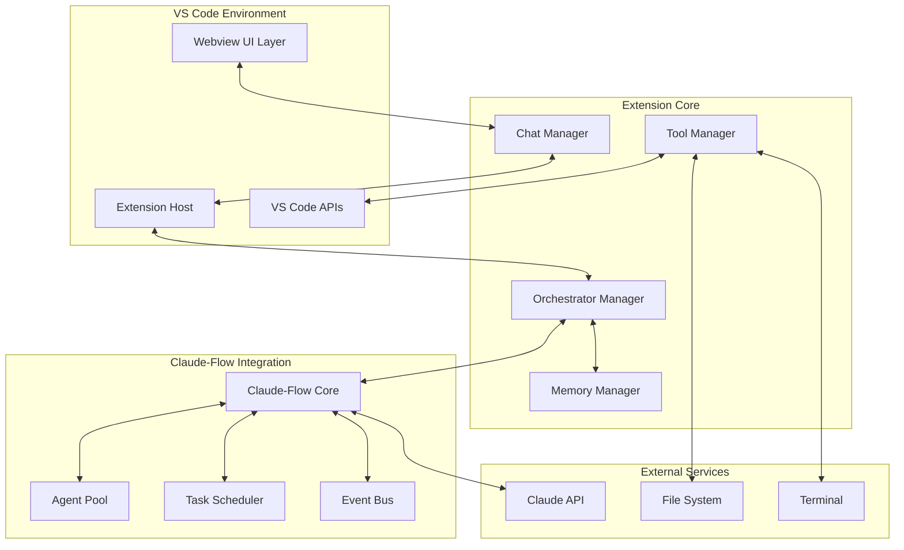
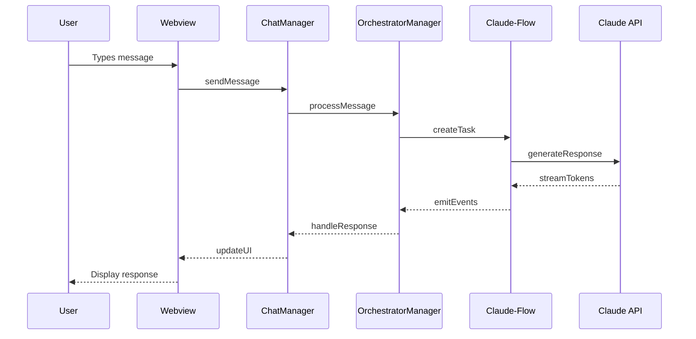
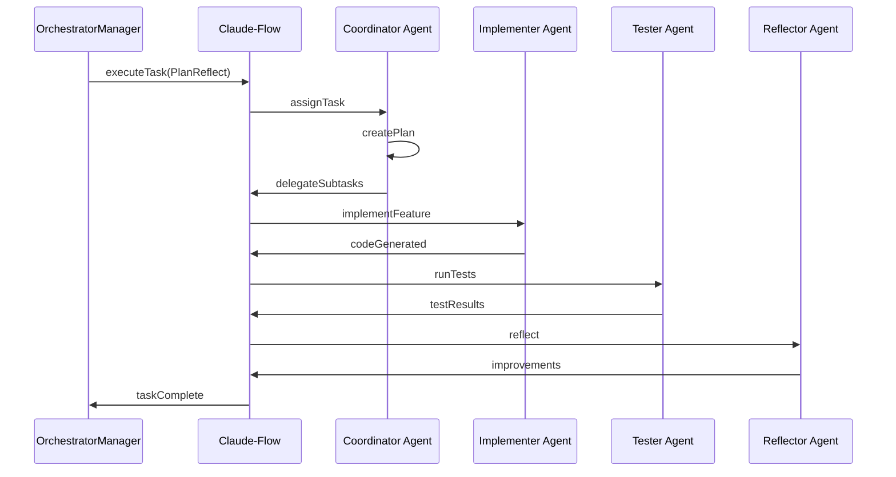

# Phase 2: Architecture Design - Claude-Flow VS Code Extension

## System Architecture Overview



## Component Architecture

### 1. Presentation Layer

#### Webview UI Components

```typescript
interface IWebviewComponents {
    ChatPanel: {
        MessageList: React.Component;
        InputBox: React.Component;
        ModeSelector: React.Component;
        StatusBar: React.Component;
    };
    
    OrchestrationPanel: {
        AgentVisualizer: React.Component;
        TaskProgress: React.Component;
        ScratchpadView: React.Component;
        MemoryViewer: React.Component;
        ToolLog: React.Component;
    };
    
    ControlPanel: {
        StopButton: React.Component;
        SettingsMenu: React.Component;
        PermissionControls: React.Component;
    };
}
```

#### Message Protocol

```typescript
// Extension -> Webview
interface IExtensionMessage {
    type: 'assistant-response' | 'agent-update' | 'task-update' | 'error';
    payload: any;
    timestamp: number;
}

// Webview -> Extension
interface IWebviewMessage {
    type: 'user-message' | 'mode-change' | 'apply-code' | 'stop-execution';
    payload: any;
}
```

### 2. Extension Host Layer

#### Core Managers

```typescript
interface IExtensionArchitecture {
    managers: {
        ChatManager: IChatManager;
        OrchestratorManager: IOrchestratorManager;
        ToolManager: IToolManager;
        MemoryManager: IMemoryManager;
        ConfigManager: IConfigManager;
    };
    
    services: {
        MessageRouter: IMessageRouter;
        EventHandler: IEventHandler;
        StateManager: IStateManager;
    };
    
    adapters: {
        VSCodeAdapter: IVSCodeAdapter;
        ClaudeFlowAdapter: IClaudeFlowAdapter;
        FileSystemAdapter: IFileSystemAdapter;
    };
}
```

### 3. Orchestration Layer

#### Claude-Flow Integration Architecture

```typescript
interface IOrchestrationLayer {
    core: {
        orchestrator: IOrchestrator;
        agentManager: IAgentManager;
        taskScheduler: ITaskScheduler;
        eventBus: IEventBus;
    };
    
    agents: {
        Coordinator: IAgent;
        Implementer: IAgent;
        Tester: IAgent;
        Reflector: IAgent;
        Analyst: IAgent;
    };
    
    workflows: {
        ChatWorkflow: IWorkflow;
        PairProgrammingWorkflow: IWorkflow;
        PlanReflectWorkflow: IWorkflow;
        CodeReviewWorkflow: IWorkflow;
    };
}
```

## Detailed Component Design

### 1. Chat Manager

**Responsibilities:**
- Manage chat session state
- Route messages between UI and orchestrator
- Handle streaming responses
- Maintain conversation history

```typescript
class ChatManager implements IChatManager {
    private sessions: Map<string, ChatSession>;
    private activeSession: string;
    private messageQueue: MessageQueue;
    
    async sendMessage(content: string, mode: OperationMode): Promise<void>;
    async streamResponse(response: AsyncIterable<string>): Promise<void>;
    getHistory(sessionId: string): Message[];
    clearSession(sessionId: string): void;
}
```

### 2. Orchestrator Manager

**Responsibilities:**
- Initialize and manage Claude-Flow orchestrator
- Configure operation modes
- Handle agent lifecycle
- Process orchestrator events

```typescript
class OrchestratorManager implements IOrchestratorManager {
    private orchestrator: IOrchestrator;
    private eventSubscriptions: Map<string, IDisposable>;
    private agentPool: Map<string, IAgent>;
    
    async initialize(config: OrchestratorConfig): Promise<void>;
    async switchMode(mode: OperationMode): Promise<void>;
    async executeTask(task: Task): Promise<TaskResult>;
    subscribeToEvents(handler: EventHandler): IDisposable;
}
```

### 3. Tool Manager

**Responsibilities:**
- Bridge Claude-Flow tools with VS Code APIs
- Implement permission checks
- Log tool invocations
- Handle tool results

```typescript
class ToolManager implements IToolManager {
    private tools: Map<string, ITool>;
    private permissionManager: IPermissionManager;
    private invocationLog: ToolInvocation[];
    
    registerTool(name: string, tool: ITool): void;
    async invokeTool(name: string, args: any): Promise<ToolResult>;
    checkPermission(tool: string, action: string): boolean;
    getInvocationHistory(): ToolInvocation[];
}
```

### 4. Memory Manager

**Responsibilities:**
- Interface with Claude-Flow memory system
- Implement context retrieval strategies
- Manage memory persistence
- Optimize context windows

```typescript
class MemoryManager implements IMemoryManager {
    private memoryStore: IMemoryStore;
    private contextCache: LRUCache<string, Context>;
    private semanticIndex: ISemanticIndex;
    
    async store(key: string, value: any): Promise<void>;
    async retrieve(query: string): Promise<Context[]>;
    async searchSemantic(query: string): Promise<SearchResult[]>;
    pruneContext(maxTokens: number): Context;
}
```

## Data Flow Architecture

### 1. User Message Flow



### 2. Multi-Agent Task Flow



## Interface Definitions

### 1. Core Interfaces

```typescript
interface IOperationMode {
    name: string;
    agents: AgentConfig[];
    workflow: WorkflowConfig;
    permissions: PermissionSet;
}

interface IAgent {
    id: string;
    role: AgentRole;
    status: AgentStatus;
    capabilities: string[];
    executeTask(task: Task): Promise<TaskResult>;
}

interface ITask {
    id: string;
    type: TaskType;
    description: string;
    assignedAgent?: string;
    subtasks?: ITask[];
    status: TaskStatus;
    result?: any;
}
```

### 2. Event System

```typescript
interface IEventBus {
    emit(event: SystemEvent): void;
    on(eventType: string, handler: EventHandler): IDisposable;
    once(eventType: string, handler: EventHandler): void;
}

interface SystemEvent {
    type: EventType;
    source: string;
    payload: any;
    timestamp: number;
}

enum EventType {
    AGENT_SPAWNED = 'agent.spawned',
    AGENT_MESSAGE = 'agent.message',
    TASK_CREATED = 'task.created',
    TASK_COMPLETED = 'task.completed',
    TOOL_INVOKED = 'tool.invoked',
    ERROR_OCCURRED = 'error.occurred'
}
```

## Security Architecture

### 1. Permission Model

```typescript
interface IPermissionManager {
    checkPermission(action: Action, context: Context): boolean;
    requestPermission(action: Action): Promise<boolean>;
    setPermissionLevel(level: PermissionLevel): void;
}

enum PermissionLevel {
    RESTRICTED = 'restricted',    // Require approval for all actions
    NORMAL = 'normal',           // Require approval for destructive actions
    AUTONOMOUS = 'autonomous'     // No approval required
}

interface Action {
    type: 'file.delete' | 'terminal.execute' | 'git.commit' | 'package.install';
    target: string;
    impact: 'low' | 'medium' | 'high';
}
```

### 2. Sandboxing Strategy

- File system operations through VS Code APIs only
- Terminal commands executed in isolated sessions
- Network requests limited to approved domains
- Resource limits enforced (CPU, memory, time)

## State Management

### 1. Application State

```typescript
interface IApplicationState {
    extension: {
        activated: boolean;
        configuration: ExtensionConfig;
    };
    
    orchestrator: {
        initialized: boolean;
        mode: OperationMode;
        agents: AgentState[];
    };
    
    chat: {
        sessions: ChatSession[];
        activeSession: string;
    };
    
    tasks: {
        active: Task[];
        completed: Task[];
        failed: Task[];
    };
}
```

### 2. State Persistence

- Session state: In-memory with optional persistence
- Configuration: VS Code workspace/user settings
- Memory: SQLite database in extension storage
- Logs: Rotating file logs with size limits

## Error Handling Strategy

### 1. Error Categories

```typescript
enum ErrorCategory {
    API_ERROR = 'api.error',           // Claude API issues
    ORCHESTRATION_ERROR = 'orch.error', // Claude-Flow errors
    PERMISSION_ERROR = 'perm.error',    // Permission denied
    TOOL_ERROR = 'tool.error',          // Tool execution failed
    SYSTEM_ERROR = 'system.error'       // VS Code or system issues
}
```

### 2. Error Recovery

- Automatic retry with exponential backoff for API errors
- Graceful degradation for non-critical features
- User notification with actionable guidance
- Error context preserved for debugging

## Performance Optimization

### 1. Strategies

- Lazy loading of UI components
- Message batching for UI updates
- Context pruning for token limits
- Caching of frequently accessed data
- Background processing for heavy operations

### 2. Resource Limits

```typescript
interface IResourceLimits {
    maxConcurrentAgents: 5;
    maxMemoryUsage: 500; // MB
    maxContextTokens: 100000;
    maxTaskQueueSize: 50;
    requestTimeout: 30000; // ms
}
```

## Testing Architecture

### 1. Test Strategy

```typescript
interface ITestArchitecture {
    unit: {
        coverage: 80; // minimum percentage
        frameworks: ['mocha', 'chai', 'sinon'];
    };
    
    integration: {
        frameworks: ['vscode-test'];
        scenarios: string[];
    };
    
    e2e: {
        frameworks: ['playwright'];
        flows: string[];
    };
    
    mocks: {
        ClaudeAPI: MockClaudeAPI;
        Orchestrator: MockOrchestrator;
        VSCodeAPI: MockVSCodeAPI;
    };
}
```

### 2. Test Doubles

- Mock Claude API with predefined responses
- Stub orchestrator for deterministic behavior
- Fake file system for isolated testing
- Test fixtures for common scenarios

## Deployment Architecture

### 1. Build Pipeline

```yaml
stages:
  - lint: ESLint + Prettier
  - typecheck: TypeScript compiler
  - unit-test: Mocha tests
  - integration-test: VS Code tests
  - bundle: Webpack production build
  - package: vsce package
  - publish: VS Code Marketplace
```

### 2. Extension Packaging

- Webpack bundling for optimized size
- Tree shaking for unused code removal
- Separate bundles for webview and extension
- Lazy loading for optional features

## Scalability Considerations

### 1. Horizontal Scaling

- Support for multiple chat sessions
- Concurrent agent execution
- Parallel task processing
- Load balancing between agents

### 2. Vertical Scaling

- Configurable resource limits
- Memory pool management
- Token budget allocation
- Priority-based scheduling

## Future Architecture Extensions

### 1. Plugin System

```typescript
interface IPluginArchitecture {
    pluginHost: IPluginHost;
    pluginAPI: IPluginAPI;
    pluginManifest: IPluginManifest;
    pluginLifecycle: IPluginLifecycle;
}
```

### 2. Multi-LLM Support

- Abstract LLM interface
- Provider-specific adapters
- Model selection UI
- Cost optimization logic

---

This architecture provides a solid foundation for implementing the Claude-Flow VS Code extension with clear separation of concerns, testability, and extensibility. The modular design ensures each component can be developed and tested independently while maintaining cohesion through well-defined interfaces.